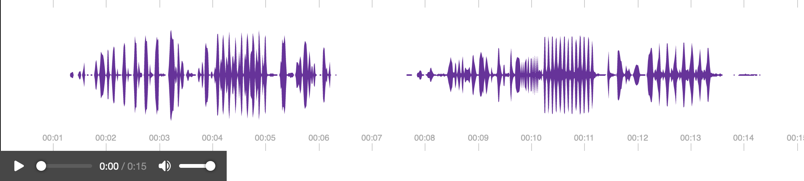

# yeswiki-extension-contrib

> Des bonnes idées d'actions et de templates à réutiliser dans vos projets. La maintenance est effectuée par la communauté YesWiki.

# Actions

## `{{ sonogramme }}`

Visualisation interactive réalisée à partir d'un fichier audio.

# Templates

_Bientôt_…
