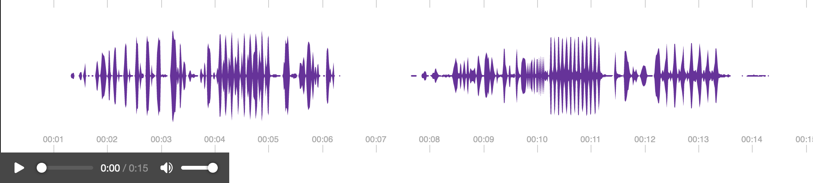

# yeswiki-extension-contrib

> Des bonnes idées d'actions et de templates à réutiliser dans vos projets. La
> maintenance est effectuée par la communauté YesWiki.

# Actions

## `{{ sonogramme }}`

Visualisation interactive réalisée à partir d'un fichier audio.



## `{{ limitentries }}`

Limite la saisie de fiches a un certain nombre indiqué (attention: ne marche
qu'a travers cette action, on peut toujours ajouter des fiches par l'admin de
bazar, par exemple..).

Les parametres `id` et `limit` sont obligatoires, `message_max` et
`message_count` optionnels

Exemple complet

```
{{limitentries id="1" limit="30" message_max="Il n'y a plus de places disponible, la limite était %{limit}, désolé..." message_count="Réservation %{nb} sur %{limit}"}}
```

# Templates

- compteur_simple.tpl.html : indique uniquement le nombre de fiches trouvées
- photoswipe.twig : galerie photo moderne
- kandan.twig : faire un tableau kandan drag n drop Usage:
  {{bazarliste id="X" template="kanban.twig" kanbanfield="bf_statut"}}

  Parametres:
  - kanbanfield : (required) field property name used to group entries into
    columns
  - kanbanaddpage : (optional) WikiPage name where the form for kanban is used
  - kanbanPersonField : (optional) field for associated persons for the kanban
  - nbcol : (optional) number of kanban columns in one line
  - kanbancolumns : (optional) comma-separated list of column values in desired
    order
  - kanbancolumnslabels : (optional) comma-separated list of labels matching
    kanbancolumns If omitted and groups=kanbanfield is set, labels come from the
    filter nodes.
